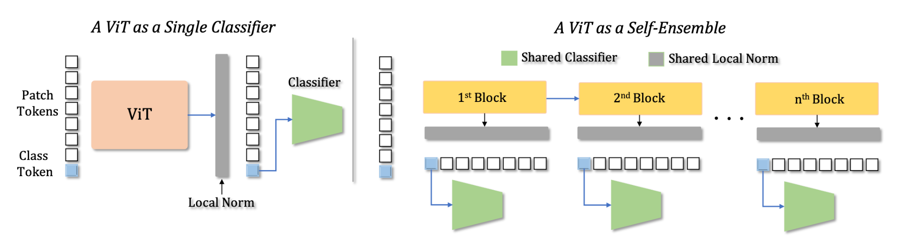
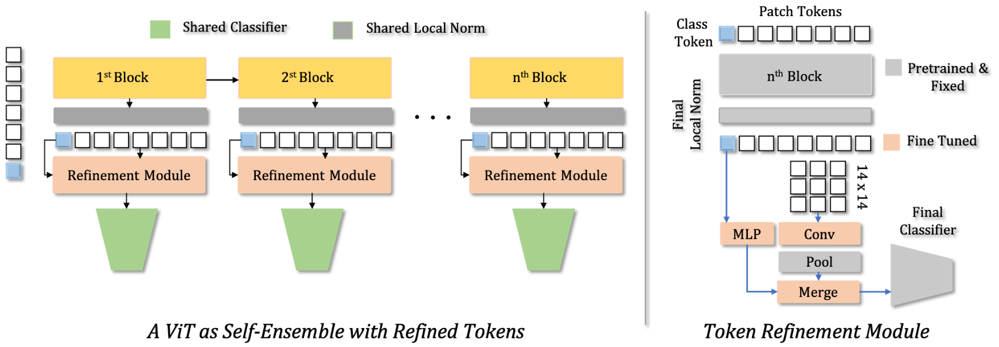

# Improving Adversarial Transferability of Vision Transformers (ICLR'22--Spotlight)

[Muzammal Naseer](https://scholar.google.ch/citations?user=tM9xKA8AAAAJ&hl=en),
[Kanchana Ranasinghe](https://scholar.google.com/citations?user=K2WBZTwAAAAJ),
[Salman Khan](https://scholar.google.com/citations?user=M59O9lkAAAAJ&hl=en),
[Fahad Khan](https://scholar.google.ch/citations?user=zvaeYnUAAAAJ&hl=en&oi=ao),
[Fatih Porikli](https://scholar.google.com/citations?user=VpB8NZ8AAAAJ&hl=en)

[Paper](https://openreview.net/forum?id=D6nH3719vZy) ([arxiv](https://arxiv.org/abs/2106.04169)), [Reviews & Response](https://openreview.net/forum?id=D6nH3719vZy)


> **Abstract:** 
*Vision transformers (ViTs) process input images as sequences of patches via self-attention;  a radically different architecture than convolutional neural networks(CNNs).  This makes it interesting to study the adversarial feature space of ViT models and their transferability. In particular, we observe that adversarial patterns found via conventional adversarial attacks show very low black-box transferability even for large ViT models. However, we show that this phenomenon is only due to the sub-optimal attack procedures that do not leverage the true representation potential of ViTs. A deep ViT is composed of multiple blocks, with a consistent architecture comprising of self-attention and feed-forward layers, where each block is capable of independently producing a class token. Formulating an attack using only the last class token (conventional approach) does not directly leverage the discriminative information stored in the earlier tokens, leading to poor adversarial transferability of ViTs. Using the compositional nature of ViT models, we enhance transferability  of  existing  attacks  by  introducing  two  novel  strategies  specific to the architecture of ViT models.(i) Self-Ensemble:We propose a method to find multiple discriminative pathways by dissecting a single ViT model into an ensemble of networks. This allows explicitly utilizing class-specific information at each ViT block.(ii) Token Refinement:We then propose to refine the tokens to further enhance the discriminative capacity at each block of ViT. Our token refinement systematically combines the class tokens with structural information preserved within the patch tokens.  An adversarial attack when applied to such refined tokens within the ensemble of classifiers found in a single vision transformer has significantly higher transferability and thereby brings out the true generalization potential of the ViT’s adversarial space.* 

## Updates \& News

## Citation
If you find our work, this repository, or pretrained transformers with refined tokens useful, please consider giving a star :star: and citation.
```bibtex
@misc{naseer2021improving,
      title={On Improving Adversarial Transferability of Vision Transformers}, 
      author={Muzammal Naseer and Kanchana Ranasinghe and Salman Khan and Fahad Shahbaz Khan and Fatih Porikli},
      year={2021},
      eprint={2106.04169},
      archivePrefix={arXiv},
      primaryClass={cs.CV}
}
```

## Contents
1) [Contributions](#Contributions) 
2) [Quickstart](#quickstart)
3) [Self-Ensemble](#self-ensemble-strategy)
4) [Token Refinement Module (TRM)](#token-refinement-module)
5) [Training TRM](#training-trm)

## Contributions
1. **Self-ensemble:** *"Your Vision Transformer is secretly an ensemble of classifiers"* We propose effective strategies to convert an off-the-shelf Vision Transformer into an ensemble of models (self-ensemble) by mapping intermediate class tokens to the final classifier.

2. **Token Refinement:** We introduce a simple training approach to refine class and patch tokens for increase in discriminative abilities across these sub-models within a single Vision Transformer. \textcolor{red}{red}

3. Our approach paves the way to enhance the representation capacity of Vision Transformer's internal representations.
4. Students and Researchers can explore the benefits of our approach in transfer learning or training a robust ViT. Practitioners can use our method to compress large ViTs with minimal drop in recognition accuracy.


## Requirements
```bash
pip install -r requirements.txt
```

## Quickstart
<sup>([top](#contents))</sup>
To directly run demo transfer attacks using baseline, ensemble, and ensemble with TRM strategies, use following scripts. The path to the dataset must be updated. 
```bash
./scripts/run_attack.sh
```

## Dataset
We use a subset of the ImageNet validation set (5000 images) containing 5 random samples from each class that are correctly classified by both ResNet50 and ViT-small. This dataset is used for all experiments. This list of images is present in `data/image_list.json`. In following code, setting the path to the original ImageNet 2012 val set is sufficient; only the subset of images will be used for the evaluation. 

## Self-Ensemble Strategy
<sup>([top](#contents))</sup>
Run transfer attack using our ensemble strategy as follows. `DATA_DIR` points to the root directory containing the validation images of ImageNet (original imagenet). We support attack types FGSM, PGD, MI-FGSM, DIM, and TI by default. Note that any other attack can be applied on ViT models using the self-ensemble strategy. 

```bash
python test.py \
  --test_dir "$DATA_DIR" \
  --src_model deit_tiny_patch16_224 \
  --tar_model tnt_s_patch16_224  \
  --attack_type mifgsm \
  --eps 16 \
  --index "all" \
  --batch_size 128
``` 

For other model families, the pretrained models will have to be downloaded and the paths updated in the relevant files under `vit_models`. 

## Token Refinement Module
<sup>([top](#contents))</sup>
For self-ensemble attack with TRM, run the following. The same options are available for attack types and `DATA_DIR` must be set to point to the data directory. 
```bash
python test.py \
  --test_dir "$DATA_DIR" \
  --src_model tiny_patch16_224_hierarchical \
  --tar_model tnt_s_patch16_224  \
  --attack_type mifgsm \
  --eps 16 \
  --index "all" \
  --batch_size 128
```

### Pretrained TRM modules

|  Model 	| Avg Acc Inc 	| Pretrained 	|
|:------:	|:-----------:	|:----------:	|
| DeiT-T 	|    12.43    	|    [Link](https://github.com/Muzammal-Naseer/Improving-Adversarial-Transferability-of-Vision-Transformers/releases/download/v0/deit_tiny_trm.pth)    	|
| DeiT-S 	|    15.21    	|    [Link](https://github.com/Muzammal-Naseer/Improving-Adversarial-Transferability-of-Vision-Transformers/releases/download/v0/deit_small_trm.pth)    	|
| DeiT-B 	|    16.70    	|    [Link](https://github.com/Muzammal-Naseer/Improving-Adversarial-Transferability-of-Vision-Transformers/releases/download/v0/deit_base_trm.pth)    	|

Average accuracy increase (Avg Acc Inc) refers to the improvement of discriminativity of each ViT block (measured by top-1 accuracy on ImageNet val set using each block output). The increase after adding TRM averaged across blocks is reported.    

## Training TRM
<sup>([top](#contents))</sup>
For training the TRM module, use the following:
```bash
./scripts/train_trm.sh
```
Set the variables for experiment name (`EXP_NAME`) used for logging checkpoints and update `DATA_PATH` to point to the ImageNet 2012 root directory (containing `/train` and `/val` folders). We train using a single GPU. We initialize the weights using a pre-trained model and update only the TRM weights. 

For using other models, replace the model name and the pretrained model path as below: 
```bash
python -m torch.distributed.launch \
  --nproc_per_node=1 \
  --master_port="$RANDOM" \
  --use_env train_trm.py \
  --exp "$EXP_NAME" \
  --model "small_patch16_224_hierarchical" \
  --lr 0.01 \
  --batch-size 256 \
  --start-epoch 0 \
  --epochs 12 \
  --data "$DATA_PATH" \
  --pretrained "https://dl.fbaipublicfiles.com/deit/deit_small_patch16_224-cd65a155.pth" \
  --output_dir "checkpoints/$EXP_NAME"
```  

## References
<sup>([top](#contents))</sup>
Code is based on [DeiT](https://github.com/facebookresearch/deit) repository and [TIMM](https://github.com/rwightman/pytorch-image-models) library. We thank the authors for releaseing their codes. 


